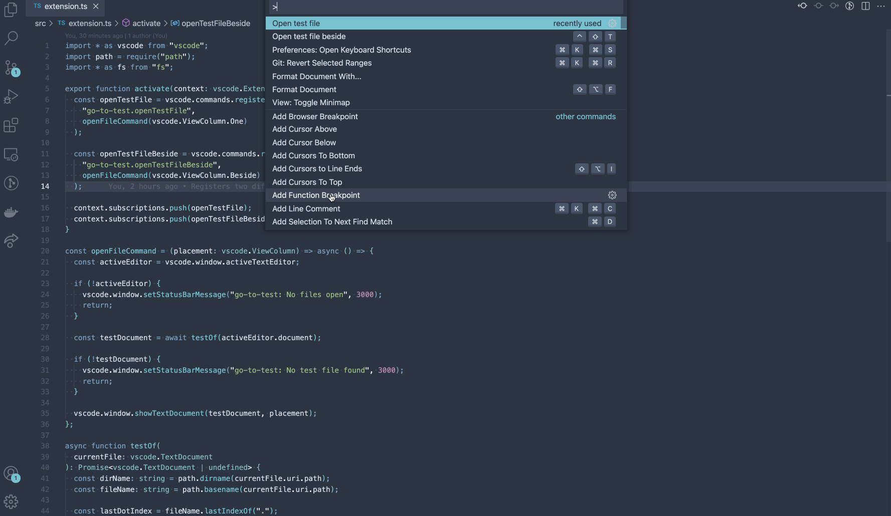

# vscode-goto-test

An extension to jump to the respective test suite of the current file.

### Open at the same group

### Or in a split view

Todos:

- Expand support to different spec patterns
- Expand support to different languages
- ~Validate inexistent test file~
- ~Add gifs~
- Add Icon
- ???
- Profit
